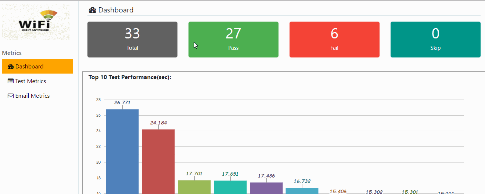

# TestNG Metrics Report

Creates HTML report based on testng-resutl.xml

[](http://hits.dwyl.io/adiralashiva8/testng-metrics)


---
__TesntNG Metrics Overview__

 

---

  - __Sample Report__ [link](https://testng-metrics.netlify.com/)
  - Source to parse testNg-report.xml [link](https://gist.github.com/adiralashiva8/f9491d7d31859eaf24c28250ab7b632f)

---

### Key Features

 - Dashboard view of execution results
 - Top 10 test performances
 - Sort and Search Results
 - Export Results
 - Generate email (.eml) with statisitics
 - No Installation required
 - Code changes not required

---

### How it Works:

1. Read testng-result.xml file using javax.xml.parsers.DocumentBuilder
2. Get Suite, Test Case , Status, Elapsed time and Error values
3. Convert data to html report using java.lang.StringBuilder

---

### How to use in Project:

1. Download Metrics.java from [here](https://github.com/adiralashiva8/testng-metrics/releases/download/v1.0/Metrics.java) and include downloaded file in project

2. Make required changes like logo, path to testng-report.xml
    > Modify logo
    >  - Line no. : 11 in file
    >  - ```String logo = "customlogo.jpg";```

    > Modify testng-report.xml path
    >  - Line no. : 17 in file
    >  - ```String path = System.getProperty("mycustompath");```

3. Execute Metrics.java file
    ```
    Javac Metrics.java
    Java Metrics
    ```

4. TestNG Metrics report __metric-timestamp.html__ file will be created in current folder

---

Thanks for using testng-metrics!

 - What is your opinion of this report?
 - What’s the feature I should add?

If you have any questions / suggestions / comments on the report, please feel free to reach me at

 - Email: <a href="mailto:adiralashiva8@gmail.com?Subject=Robotframework%20Metrics" target="_blank">`adiralashiva8@gmail.com`</a> 
 - LinkedIn: <a href="https://www.linkedin.com/in/shivaprasadadirala/" target="_blank">`shivaprasadadirala`</a>
 - Twitter: <a href="https://twitter.com/ShivaAdirala" target="_blank">`@ShivaAdirala`</a>

---

*Credits:*

1. TestNG [link](https://testng.org/doc/index.html)
2. Stackoverflow [link](http://stackoverflow.com)
3. Google charts [link](https://developers.google.com/chart/)
4. DataTable [link](https://datatables.net/examples/basic_init/table_sorting.html)
5. Java [link](https://www.java.com)
6. Jquery | JavaScript [link](https://www.jqueryscript.net)
7. Bootstrap [link](http://getbootstrap.com/docs/4.1/examples/dashboard/)
8. Icons8 [link](https://icons8.com/)
9. FontAwesome [link](https://fontawesome.com)

---

Inspired from [robotframework-metrics](https://github.com/adiralashiva8/robotframework-metrics)

---
